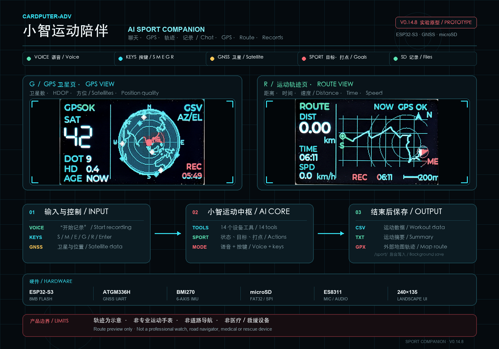
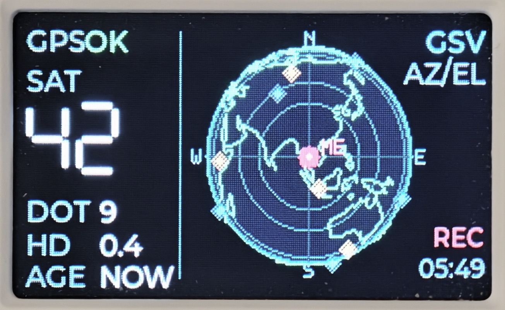
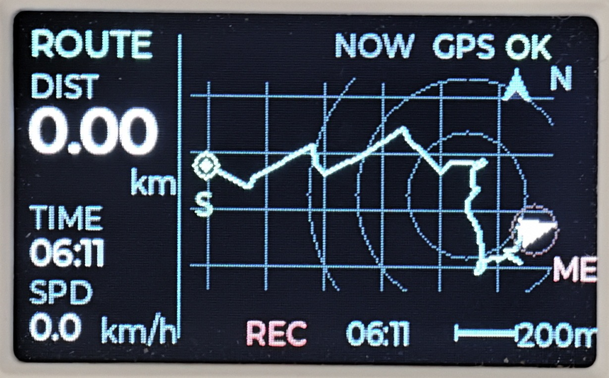

# Cardputer-Adv Sport Companion / 小智运动陪伴

> Voice chat, GPS status, route preview and workout records on M5Stack Cardputer-Adv.
> 在 M5Stack Cardputer-Adv 上实现小智语音陪伴、GPS 状态、简易轨迹和运动记录。



## What it does / 能做什么

- XiaoZhi online voice chat during running, cycling and hiking. / 跑步、骑行、徒步时与小智联网对话。
- Start, pause, resume, mark and finish a workout by voice or keyboard. / 通过语音或键盘控制运动记录。
- Show satellite count, HDOP, GPS quality and GSV satellite positions. / 查看卫星数、HDOP、定位质量和卫星方位。
- Show distance, time, speed and a compact route preview. / 查看距离、时间、速度和简易轨迹。
- Save CSV workout data, TXT summary and GPX route to microSD. / 向 microSD 保存 CSV、TXT 摘要和 GPX。

| GPS view / 卫星页 | Route view / 轨迹页 |
| --- | --- |
|  |  |

## Keys / 按键

| Key | Action / 功能 |
| --- | --- |
| `S` | Start, pause or resume / 开始、暂停或继续 |
| `M` | Add a mark / 手动打点 |
| `E` | Finish and queue SD export / 结束并保存 |
| `G` | GPS satellite view / GPS 卫星页 |
| `R` | Current route view / 本次轨迹页 |
| `Enter` | Toggle XiaoZhi chat / 开始或结束小智对话 |
| `↑ / ↓` | Volume / 音量 |
| `← / →` | Brightness / 亮度 |

## Install / 安装

**Device:** M5Stack Cardputer-Adv, ESP32-S3, 8MB Flash
**Firmware:** [`Cardputer-Adv-Sport-v0.14.8.bin`](firmware/Cardputer-Adv-Sport-v0.14.8.bin)
**Flash address:** `0x0`
**SHA-256:** `b7d1696f0ee988c3d1ed43bbfcc4ae8078464c2b5f3a2f4c031f730164cde2e0`

This is a full-flash image and replaces Launcher. Back up anything important first.
这是完整直刷固件，会覆盖 Launcher，请先备份重要内容。

```bash
python3 -m esptool --chip esp32s3 --port /dev/cu.usbmodem1101 \
  --baud 460800 --before default_reset --after hard_reset \
  write_flash -z --flash_mode dio --flash_freq 80m --flash_size 8MB \
  0x0 "firmware/Cardputer-Adv-Sport-v0.14.8.bin"
```

The serial port may be different. On macOS, find it with:
串口名称可能不同，macOS 可用下面的命令查找：

```bash
ls /dev/cu.* /dev/tty.* | grep -E "usb|modem|serial"
```

Full setup, first-start and troubleshooting steps:
完整烧录、首次使用和排查说明：

- [User Guide / 中英双语使用手册](docs/USER_GUIDE_CN_EN.md)
- [Xiaohongshu Post / 小红书中英双语文案](docs/XIAOHONGSHU_POST_CN_EN.md)

## Saved files / 保存文件

After finishing, wait 5–15 seconds. Files are written to `/sport/`:
结束后等待 5–15 秒，文件写入 `/sport/`：

- `logNNN.csv`: structured workout data / 结构化运动数据
- `sumNNN.txt`: workout summary / 本轮运动摘要
- `trkNNN.gpx`: route for external map apps / 可导入外部地图的轨迹

## Limits / 产品边界

- The route is a filtered visual preview without road maps and stores up to 96 points. / 轨迹只是无道路底图的折线示意，最多缓存 96 点。
- GPS may drift indoors, under trees or between buildings. / 室内、树林和高楼之间可能出现定位漂移。
- XiaoZhi voice chat requires Wi-Fi or a phone hotspot. / 小智对话需要 Wi-Fi 或手机热点。
- This is not a professional sports watch, road navigator, medical or rescue device. / 不是专业运动手表、道路导航、医疗或救援设备。
- Do not operate the screen while moving through traffic. / 骑行、跑步或过马路时不要持续操作屏幕。

## Project status / 项目状态

`v0.14.8` is an experimental prototype tested on one Cardputer-Adv setup. Hardware revisions, GNSS modules, microSD cards and network conditions may behave differently.
`v0.14.8` 是在一套 Cardputer-Adv 硬件上验证的实验原型，不同硬件批次、GNSS、microSD 和网络环境可能表现不同。

## Credits / 致谢

- [78/xiaozhi-esp32](https://github.com/78/xiaozhi-esp32): XiaoZhi ESP32 firmware foundation.
- [nongxl/SkyCompass_Satellite](https://github.com/nongxl/SkyCompass_Satellite): satellite visualization reference.
- [DevinWatson/Cardputer-Adv-GPS-Info](https://github.com/DevinWatson/Cardputer-Adv-GPS-Info): Cardputer-Adv GPS reference.
- [M5Stack Cardputer-Adv](https://docs.m5stack.com/): hardware platform.

## License

MIT License. See [LICENSE](LICENSE) and [THIRD_PARTY_NOTICES.md](THIRD_PARTY_NOTICES.md). XiaoZhi cloud services and third-party services remain subject to their own terms.
